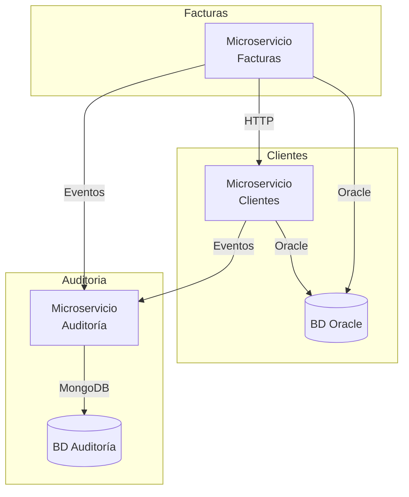

# Plataforma de Microservicios – Clientes, Facturas y Auditoría

## Tabla de Contenidos
- [Descripción General](#descripción-general)
- [Arquitectura](#arquitectura)
- [Requisitos](#requisitos)
- [Infraestructura con Docker](#infraestructura-con-docker)
- [Servicios](#servicios)
  - [Microservicio de Clientes](#microservicio-de-clientes)
  - [Microservicio de Facturas](#microservicio-de-facturas)
  - [Microservicio de Auditoría](#microservicio-de-auditoría)
- [Scripts y Utilidades](#scripts-y-utilidades)
- [Pruebas Automatizadas](#pruebas-automatizadas)
- [Solución de Problemas](#solución-de-problemas)
- [Próximos Pasos](#próximos-pasos)

## Descripción General
- **MicroservicioClientes/** gestiona clientes sobre Oracle y expone API REST.
- **MicroservicioFacturas/** procesa facturas, valida clientes y registra auditorías.
- **MicroservicioAuditoria/** persiste eventos en MongoDB y permite consultas históricas.
- **docker-compose.yml** inicia Oracle XE y MongoDB con scripts en `scripts/`.
- **Documentación complementaria**: `QUICK_START.md` (arranque rápido) y `DOCKER_SETUP.md` (detalle de infraestructura).

## Arquitectura


## Requisitos
- **.NET 7+ SDK** para microservicios en C#.
- **Ruby 3.0+** y Bundler para el servicio de auditoría.
- **Docker y Docker Compose** (opcional pero recomendado para bases de datos).
- **MongoDB 6** y **Oracle Database 21c XE** si se ejecutan sin Docker.

## Infraestructura con Docker
- **Oracle XE**
  - Imagen: `container-registry.oracle.com/database/express:21.3.0-xe`
  - Puertos: `1521`, `5500`
  - Credenciales por defecto: `system/oracle123@//localhost:1521/XEPDB1`
  - Scripts: `scripts/oracle/`
- **MongoDB 6**
  - Imagen: `mongo:6`
  - Puerto: `27017`
  - Scripts: `scripts/mongo/`

```bash
# Levantar servicios de base de datos
docker compose up -d
docker compose ps

# Detener servicios
docker compose down
```

## Servicios

### Microservicio de Clientes
- **Ruta**: `MicroservicioClientes/`
- **Pilas**: ASP.NET Core, Oracle Managed Data Access
- **Capacidades**:
  - CRUD de clientes con validaciones de negocio en `Clientes.Domain/Cliente.cs`.
  - `ClienteService` mapea DTOs y orquesta repositorio (`Clientes.Application/`).
  - `OracleClienteRepository` y `HttpAuditoriaClient` en `Clientes.Infrastructure/`.
  - API REST en `Clientes.WebApi/ClientesController.cs` (puerto 5100).
- **Ejecución**
```bash
cd MicroservicioClientes
dotnet restore
dotnet test
dotnet run --project Clientes.WebApi
```
- **Endpoints**

| Método | Ruta | Descripción |
| --- | --- | --- |
| POST | `/api/clientes` | Crear cliente |
| GET | `/api/clientes/{id}` | Obtener cliente por identificador |
| GET | `/api/clientes` | Listar clientes |

**Ejemplo de creación**
```http
POST http://localhost:5100/api/clientes
Content-Type: application/json
{
  "nombre": "Juan",
  "identificacion": "123456789",
  "correo": "juan@example.com",
  "direccion": "Calle 1"
}
```

### Microservicio de Facturas
- **Ruta**: `MicroservicioFacturas/`
- **Pilas**: ASP.NET Core, Oracle Managed Data Access, HttpClient
- **Capacidades**:
  - `Factura` valida monto, fecha y cliente en `Facturas.Domain/Factura.cs`.
  - `FacturaService` verifica existencia de cliente (`IClienteGateway`) y envía auditorías.
  - `OracleFacturaRepository`, `HttpClienteGateway`, `HttpAuditoriaClient` en `Facturas.Infrastructure/`.
  - API REST en `Facturas.Api/FacturasController.cs` (puerto 5002).
- **Ejecución**
```bash
cd MicroservicioFacturas
dotnet restore
dotnet test
dotnet run --project Facturas.Api
```
- **Endpoints**

| Método | Ruta | Descripción |
| --- | --- | --- |
| POST | `/api/facturas` | Crear factura |
| GET | `/api/facturas/{id}` | Obtener factura por identificador |
| GET | `/api/facturas?desde&hasta` | Listar facturas por rango de fechas |

**Ejemplo de creación**
```http
POST http://localhost:5002/api/facturas
Content-Type: application/json
{
  "clienteId": 1,
  "fechaEmision": "2025-10-19",
  "montoTotal": 150000
}
```

### Microservicio de Auditoría
- **Ruta**: `MicroservicioAuditoria/`
- **Pilas**: Ruby 3, Sinatra, MongoDB Ruby Driver
- **Capacidades**:
  - `config/database.rb` crea cliente `Mongo::Client` hacia `mongodb://localhost:27017/auditoria_db`.
  - `models/evento.rb` normaliza claves (camelCase, snake_case, mayúsculas) y valida campos.
  - `app.rb` expone endpoints REST en puerto 5003.
  - `README.md` local detalla ejemplos de integración.
- **Ejecución**
```bash
cd MicroservicioAuditoria
bundle install
bundle exec ruby app.rb
```
- **Endpoints**

| Método | Ruta | Descripción |
| --- | --- | --- |
| POST | `/auditoria` | Registrar evento |
| GET | `/auditoria` | Listar eventos |
| GET | `/auditoria/{entidadId}` | Buscar eventos por entidad |
| GET | `/health` | Estado del servicio |

**Ejemplo de registro**
```bash
curl -X POST http://localhost:5003/auditoria \
  -H "Content-Type: application/json" \
  -d '{
        "servicio": "clientes",
        "entidad": "Cliente",
        "entidadId": "123",
        "accion": "CREATE",
        "detalles": "Cliente creado"
      }'
```

## Scripts y Utilidades
- **`scripts/oracle/`** contiene DDL y datos iniciales para Oracle XE.
- **`scripts/mongo/`** almacena scripts opcionales de inicialización para MongoDB.

## Pruebas Automatizadas
- **Clientes**: `dotnet test MicroservicioClientes`
- **Facturas**: `dotnet test MicroservicioFacturas`
- **Auditoría**: validar endpoints con `curl`, Postman o pruebas personalizadas.

## Solución de Problemas
- **ORA-00001 constraint violated**: ya existe cliente/factura con valores únicos; revisar datos de entrada.
- **Errores 400 al auditar**: asegurarse de enviar JSON válido con `servicio`, `entidad`, `entidadId`, `accion`.
- **Puertos ocupados (5002/5003/5100)**: listar procesos (`lsof -i :puerto`) y finalizarlos (`kill <pid>`).
- **MongoDB requiere autenticación**: ajustar `config/database.rb` con credenciales o ejecutar contenedor sin `--auth`.

## Próximos Pasos
- Integrar documentación adicional de `DOCKER_SETUP.md` y `QUICK_START.md` en un único manual.
- Añadir pruebas de integración que combinen los tres servicios.
- Contenerizar los microservicios para despliegue completo con Docker Compose o Kubernetes.


